# Étude détaillée — bras articulé 3 axes et boîtier pour Camera Module 3 sur boîtier Raspberry Pi 5

**Projet** : camera-RPi5-comptage · **Imprimante** : Prusa (Biscalab) · **Date** : 30/09/2026, **révisions du 01/10/2026** (vérification du passage de la nappe et de la tenue de la caméra, § 16 ; jeu de filetage calé à 0,3 après l'essai d'impression, § 6.6)
**Livrables** : cette étude, la macro FreeCAD paramétrique (`freecad/bras_camera_cm3.py`), les fichiers natifs FreeCAD `.FCStd` (une pièce par fichier + un assemblage), les STEP, les STL orientés pour l'impression, les rendus et le rapport de contrôle (`export/rapport.json`).

> **Outillage — point important.** Cette session cloud n'avait **aucun connecteur MCP FreeCAD** : il n'en existe pas dans le registre de connecteurs claude.ai, et les « FreeCAD MCP » communautaires sont des ponts locaux vers une instance FreeCAD graphique tournant sur la machine de l'utilisateur. J'ai donc installé **FreeCAD lui-même** (paquet conda-forge, version 26.3) dans le conteneur et piloté son API Python en mode headless (`freecadcmd`), c'est-à-dire exactement ce qu'un connecteur MCP FreeCAD ferait sous le capot. Résultat : de vrais documents `.FCStd` ouvrables dans ton FreeCAD, et une macro que tu peux rejouer chez toi pour tout régénérer avec d'autres paramètres.

---

## 1. Résumé de la solution

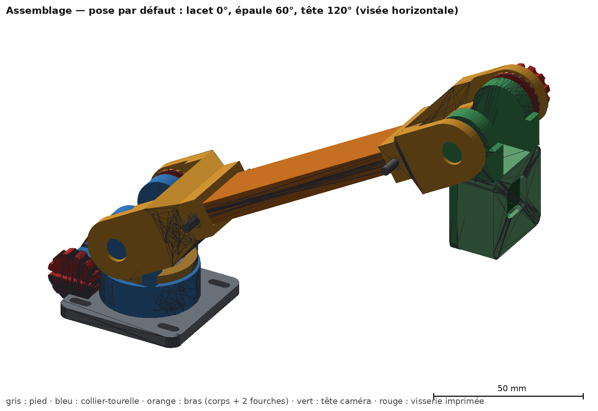

| Élément | Choix retenu | Pourquoi |
|---|---|---|
| Cinématique | **3 axes** : lacet (tourelle sur fût creux) + tangage d'épaule + tangage de tête | Pan/tilt indispensables pour viser une scène de comptage ; l'épaule règle hauteur et portée. Un 4ᵉ axe (coude) est possible sans changer les pièces (voir § 13). |
| Passage de la nappe | **Intérieur** : fût creux Ø20 → fenêtre entre les plaques de noix → canal fermé 18 × 2,4 dans le bras → fente de la tête ; **toutes les entrées sont évasées** (entonnoirs) et les arêtes du fût chanfreinées | Nappe protégée, jamais pincée, enfilage sans accrochage ; longueur de trajet quasi constante quel que soit l'angle car **l'axe de chaque charnière est dans le plan de la nappe**. |
| Articulations | Charnière « à fenêtre » **symétrique** : noix à 2 plaques + fourche à 2 oreilles crantées, serrage **de chaque côté** par une **vis moletée M8 imprimée** et un **écrou-rosette 24 dents** (pas 15°) | Verrouillage positif (crantage) insensible au fluage, contrairement à une friction pure ; visserie 100 % imprimée ; aucun jeu dans la charnière ; la fourche se monte par simple glissement sur la noix (écrous enfoncés), sans écarter les oreilles. |
| Lacet | Collier fendu serré sur le fût par la même vis imprimée, rendu captif par une goupille Ø3 imprimée qui court dans une rainure du fût | Réglage continu 360° (limité par la torsion de nappe : ±90° conseillé), aucun filetage de grand diamètre à imprimer. |
| Bras | **Deux pièces** : corps plat 24 × 8 (longueur paramétrable) + 2 fourches identiques emmanchées 21 mm | Chaque pièce s'imprime **sans support** ; changer la longueur = réimprimer le seul corps. |
| Tête caméra | Coque + façade encliquetée ; PCB **plaqué sans jeu** sur les 4 plots de la coque (pions Ø1,8 de centrage) par les 4 fûts de la façade, portés par des **languettes-ressorts** découpées dans la plaque avant (précontrainte 0,2 mm) | Zéro vis M2, zéro jeu (vibrations) ; la caméra est référencée sur la pièce qui porte la charnière ; l'objectif ne touche jamais la façade ; respect de la zone du flex autofocus. |
| Fixation au boîtier RPi5 | **Sur le couvercle** : pied à platine 50 × 46 dont le fût est décalé vers le bord (la platine affleure la paroi, la nappe monte à 16 mm du bord), 4 fentes 3,4 × 8 (2 à 4 vis M3 **ou** goupilles imprimées collées), trou Ø22 dans le couvercle sous le fût ; gabarit de perçage imprimable + DXF/SVG. Variantes : platine centrée, adaptateur « cavalier ». | Décision utilisateur du 30/09 : fixation sur couvercle. |
| Quincaillerie métallique | **Zéro par défaut**. Optionnel : 2 à 4 vis M3 pour la platine si tu préfères aux goupilles collées | Demande explicite du cahier des charges. |

**Plages validées par calcul d'interférences (aucune collision)** : épaule 0 → 100° depuis la verticale ; tête 0 → 135° de pliage ; lacet 360°. Plages **recommandées** (rayon de pliage de la nappe ≥ 6 mm) : épaule 0 → 95°, tête 0 → 120°.

**Budget câble** (nappe officielle Standard–Mini 300 mm, entraxe de bras 150 mm, platine posée sur le couvercle) : 258 mm consommés, **≈ 42 mm de marge** ; le tronçon dans le boîtier Pi (≈ 35 mm mesurés sur la photo du 30/09 + coude + insertion = 45 mm) reste à confirmer au montage. Un corps de bras alternatif d'entraxe **170 mm** est fourni (marge ≈ 22 mm).

---

## 2. Ce que les photos m'ont appris et les hypothèses retenues

| Observation (photos) | Conséquence pour la conception |
|---|---|
| **Raspberry Pi Camera Module 3** standard (autofocus IMX708, bloc objectif carré ≈ 11,5 mm mesuré sur ta photo, flex VCM noir remontant vers le bord haut). | Contour PCB 25,0 × 23,86 mm, 4 trous Ø2,2 à 21 × 12,5 mm, trous hauts à 2 mm du bord haut ; centre optique sur la ligne des trous bas, centré en largeur ; hauteur du bloc objectif prise à **8,5 mm** au-dessus du PCB (`objectif_h`, à mesurer au pied à coulisse : § 12) avec 1,7 mm de dégagement sous la façade ; le Module 3 **Wide** (≈ 9 mm) passe sans modification. |
| Connecteur nappe **15 broches 1 mm** au dos, sur le bord bas ; nappe sortant vers le bas dans le plan de la carte ; composants dos ≤ 1,5 mm, connecteur ≈ 3 mm. | Dégagement dos 4 mm ; plan de nappe à 1,2 mm derrière le dos du PCB ; fente 18 × 2,4 dans la paroi basse de la coque. |
| Câble **« Raspberry Pi Camera Cable Standard – Mini 300 mm »** : 16 mm de large côté caméra, ~12 mm côté Pi 5 (22 broches 0,5 mm). | Canal et fenêtres de 18 mm ; les deux extrémités (raidisseur ≈ 0,6 mm d'épaisseur) passent partout : la séquence de montage du § 10 enfile l'extrémité **Standard** depuis le Pi vers la tête, le connecteur de la caméra se branchant PCB hors de la coque. |
| **Pi 5 + AI HAT+ (Hailo)** dans un boîtier imprimé noir à fentes d'aération verticales, parois ≈ 3 mm ; la nappe sort par le dessus ; **un couvercle recevra le pied** (décision du 30/09). Sur la photo au mètre-ruban, le connecteur CAM se situe ≈ 35 mm sous le bord du boîtier, le long d'une paroi longue. | Pied « couvercle » à fût décalé (`pied_decal` = 10) : platine affleurant la paroi, trou nappe Ø22 dans le couvercle à 16 mm du bord extérieur ; gabarit de perçage fourni (STL, DXF, SVG). Variante cavalier conservée (`mur_ep` = 3). |

Autres hypothèses : PETG (fluage faible, tenace) ; buse 0,4 ; couches 0,2 (0,15 pour la visserie) ; retrait/élargissement FDM typique de 0,1 à 0,2 mm sur les trous, compensé par les jeux listés au § 9.

---

## 3. Cahier des charges déduit

1. Porter une Camera Module 3 (≈ 4 g) au bout d'un bras d'environ la longueur du câble (300 mm), fixé sur le boîtier du Pi 5.
2. Trois axes de réglage, maintien de la position sans dérive une fois réglé (application fixe de comptage).
3. Nappe protégée sur tout le trajet, sans pliure serrée (rayon statique ≥ 5 à 6 mm), sans traction sur les connecteurs.
4. Le moins de quincaillerie métallique possible ; pièces imprimables sur Prusa (plateau 250 × 210) **sans support**.
5. Montage / démontage à la main (aucun outil, sauf éventuellement une pièce de monnaie pour les vis moletées).
6. Respect des zones sensibles de la caméra : flex autofocus à l'avant, connecteur au dos, champ de vision (66° H × 41° V, 75° diagonal pour le module standard).

---

## 4. Options étudiées et arbitrages

### 4.1 Type d'articulation

| Option | Avantages | Inconvénients | Verdict |
|---|---|---|---|
| Rotule imprimée + collier fendu | 3 axes en une pièce | Fluage du plastique, tenue aléatoire, nappe forcément à l'extérieur | rejetée |
| Charnière à friction plane (boulon traversant) | simple | Le boulon occupe l'axe → la nappe doit contourner l'axe : longueur variable, boucles de réserve, pincement ; tenue dépendante du serrage (fluage) | rejetée |
| Charnière à pions latéraux + friction | axe libre pour la nappe | tenue uniquement par friction | rejetée |
| **Charnière à fenêtre + rosette crantée (24 dents) + vis imprimée** | axe libre pour la nappe, **verrouillage positif**, réglage par pas de 15°, visserie imprimée | 1 vis + 1 écrou par axe, réglage discret (15°) | **retenue** (le pas de 15° est largement suffisant pour cadrer une scène ; l'autofocus et le recadrage logiciel font le reste) |

### 4.2 Passage de la nappe

| Option | Verdict |
|---|---|
| Nappe à l'extérieur, colliers | rejetée : inesthétique, exposée, boucles aux articulations |
| Canal ouvert (U) + clips | possible mais moins protecteur |
| **Canal fermé 18 × 2,4 traversant + fenêtres à l'axe** | **retenue** : on enfile l'extrémité étroite (Mini) ; pont de 18 mm trivial pour la Prusa |

### 4.3 Axe de charnière dans le plan de la nappe ou décalé ?

Un premier passage de conception avec l'axe décalé de 7 mm (pour imprimer le bras d'une pièce à plat) a été **invalidé par le calcul** : au-delà de ~90° de pliage, le point d'entrée du canal côté tête revient vers le point de sortie côté bras et la nappe devrait former une boucle impossible. Avec l'axe **dans** le plan de la nappe, le trajet est un arc tangent aux deux canaux : rayon 11 mm à 90°, 6,4 mm à 120°, longueur quasi constante, et le pliage est possible **des deux côtés** (le bras peut basculer à gauche ou à droite de la tourelle sans changer de pièces).

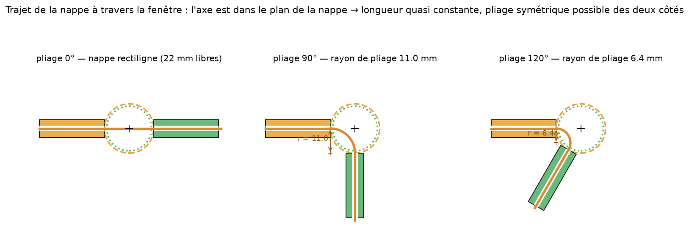

Conséquence : oreilles symétriques (±11 mm autour de l'axe), donc bras en **deux pièces** pour imprimer sans support (corps à plat, fourches debout).

### 4.4 Fixation de la caméra

| Option | Verdict |
|---|---|
| 4 vis M2 + entretoises | rejetée (métal) |
| Pions Ø2 thermo-rivetés | irréversible |
| **Sandwich coque/façade sur les 4 trous, pions de centrage Ø1,8, façade encliquetée, fûts de façade sur languettes-ressorts** | **retenue** : démontable, zéro vis, précontrainte tolérante aux cotes FDM (zéro jeu quelle que soit l'épaisseur réelle de l'empilage) |

### 4.5 Fixation sur le boîtier du Pi 5

| Option | Verdict |
|---|---|
| Vissage direct dans le chant d'une paroi de 3 mm | impossible (trop mince) |
| **Platine 4 fentes sur le couvercle**, fût décalé vers le bord, vis M3 ou goupilles imprimées collées, trou Ø22 sous le fût | **retenue** (décision du 30/09) |
| **Adaptateur cavalier** à cheval sur une paroi, 2 trous traversant les fentes d'aération | **fournie en variante** (`01b_cavalier_adaptateur`) |
| Écrou-tenon dans une fente d'aération (boulon imprimé plat) | à étudier une fois la largeur des fentes mesurée |

### 4.6 Matière

**PETG** recommandé (tenue au fluage sous précontrainte, ténacité, surfaces des filets). PLA acceptable pour un prototype de validation des cotes ; ASA/ABS si exposition au soleil derrière une vitre.

---

## 5. Architecture et cinématique

### 5.1 Repères et poses

* Pied : Z vertical, platine en Z = −4…0, fût Ø26 lisse jusqu'à Z = 11,5 (rainure de retenue 3,4 × 1,2 centrée en Z = 6), alésage Ø20 traversant.
* Collier-tourelle : Z = 0…12 ; **axe d'épaule** horizontal (Y) à Z = 28, à l'aplomb du fût.
* Bras : X = longueur (entraxe `bras_L` = 150), Y = axes de charnière, Z = épaisseur ; plan de nappe Z = 0.
* Tête : x = largeur PCB, y = hauteur (connecteur en bas), z = profondeur (objectif vers +z) ; axe de tête à 12 mm sous la paroi basse, dans le plan de nappe (z = 4,8).

Angles : **lacet ψ** (rotation du collier), **épaule θ** (0 = bras vertical, 90 = horizontal), **tête β** (0 = tête dans le prolongement du bras, 90 = perpendiculaire, objectif vers l'avant du bras).

### 5.2 Table de visée (élévation de l'axe optique, calculée par le script)

| épaule θ \ tête β | 60° | 90° | 120° | 150° |
|---|---|---|---|---|
| 45° | +75° | +45° | +15° | −15° |
| **60°** | +60° | +30° | **0° (horizontal)** | −30° |
| 90° | +30° | 0° | −30° | −60° |

Règle simple : **élévation = 180° − θ − β**. Pour viser vers le bas (comptage d'un passage vu de haut), on met le bras horizontal (θ = 90) et la tête à 120–135°.

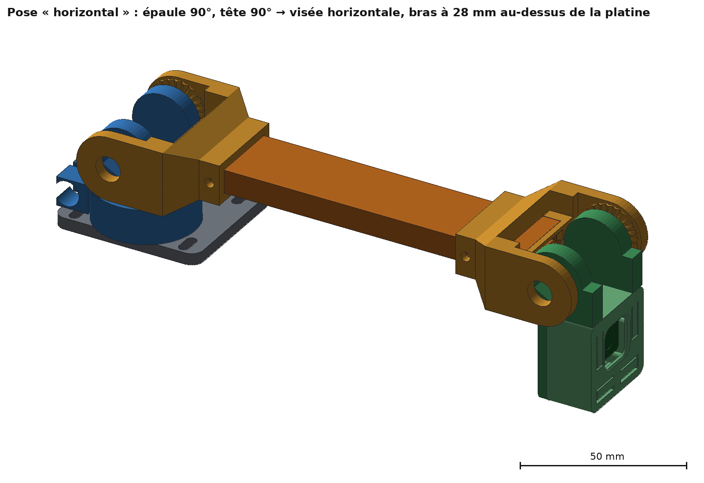
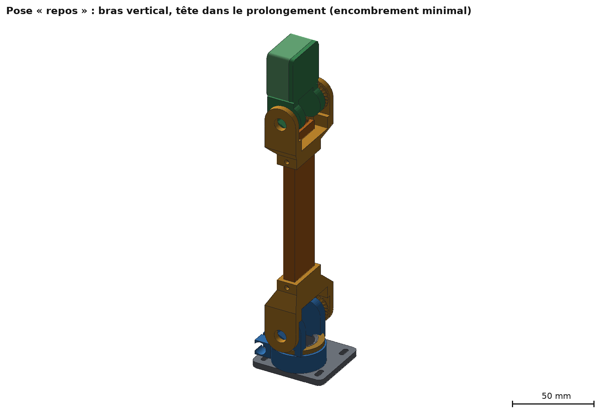
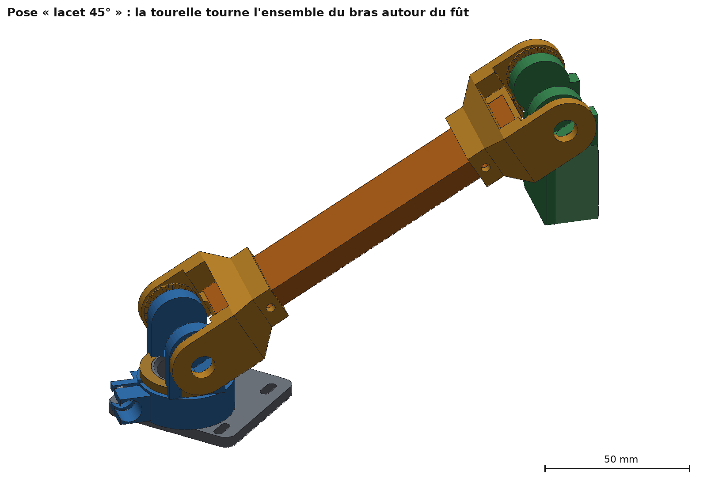

### 5.3 Plages et butées

| Axe | Plage sans collision (calculée) | Plage recommandée | Limite physique |
|---|---|---|---|
| Lacet ψ | 360° | ±90° autour de la position neutre | torsion de la nappe sur ≈ 40 mm libres entre la sortie du boîtier Pi et l'épaule |
| Épaule θ | 0 → 100° (4,021 mm³ de contact à 105°) | 0 → 95° | le bloc racine de la fourche touche le collier (pieds des plaques, anneau) au-delà |
| Tête β | 0 → 135° (417 mm³ à 150°) | 0 → 120° | rayon de nappe 6,4 mm à 120°, 4,6 mm à 135° ; face arrière de la tête vers l'évasement de la fourche à 150° |

---

## 6. Détail des sous-ensembles

### 6.1 Articulation « à fenêtre » (commune épaule / tête)

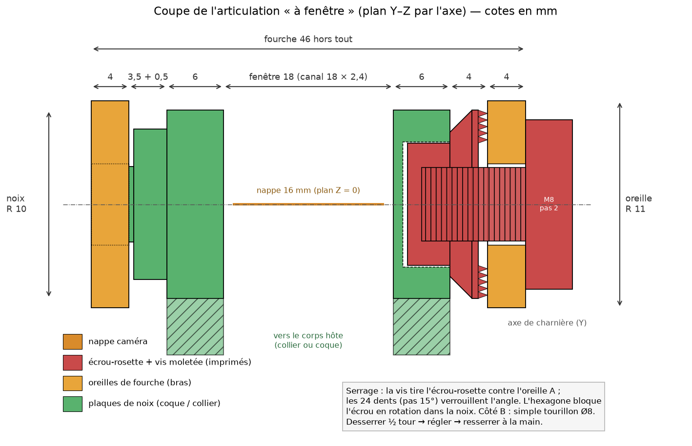
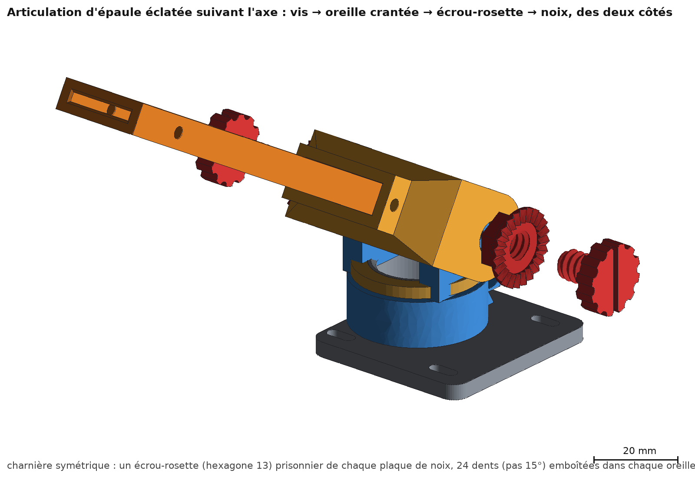

Empilage le long de l'axe (cotes en mm), **identique des deux côtés** : fenêtre 18 (nappe 16) → plaque de noix 6 (poche hexagonale 13,3 profonde 5, fond 1 mm) → écrou-rosette : hexagone 13 × 3,5 dans la poche, flasque conique 45° (imprimable sans support), plat, **24 dents de 1 mm** (r 6,5 → 10) → oreille 4 mm portant les dents complémentaires sur sa face intérieure, alésage Ø8,6 → tête de vis Ø18 × 5, moletée 12 crans, fente pour pièce de monnaie → filet M8 pas 2 × 11.

**Pourquoi symétrique (révision du 01/10)** : la version précédente avait un tourillon fixe Ø8 × 3,5 côté B. Pour l'engager dans l'oreille il aurait fallu écarter les oreilles de 3,5 mm, soit ≈ 2 % de déformation dans le sens des couches d'une fourche imprimée debout : inacceptable en PLA. Avec deux poches et deux écrous, chaque écrou **recule de 1,5 mm** au fond de sa poche (hexagone 3,5 dans 5 mm) : ses dents passent alors 0,5 mm sous celles de l'oreille et la fourche **se glisse** sur la noix sans aucune déformation ; les vis ramènent ensuite les écrous contre les oreilles. Vérifié dans la macro : volume d'interférence le long du trajet de glissement = 0 mm³ (§ 8). Le serrage des deux côtés supprime aussi le jeu axial de 0,5 et le jeu radial de 0,3 qu'avait le côté B : plus aucune pièce flottante dans la charnière.

Fonctionnement : chaque vis tire son écrou-rosette contre son oreille ; les dents s'emboîtent (pas 15°) ; l'hexagone bloque l'écrou dans la noix ; le couple passe donc noix → hexagone → dents → oreille, **sans dépendre de la friction**, par deux chemins parallèles. Les vis ne supportent que la précontrainte axiale.

Dimensionnement : masse mobile à l'épaule ≈ 55 g (bras ≈ 33 g, tête équipée ≈ 20 g), centre de gravité ≈ 90 mm → couple ≈ **0,05 N·m**. Couple de verrouillage d'une rosette ≈ F·r_moyen ≈ 100 N × 8,25 mm ≈ 0,8 N·m pour un serrage à la main modéré (vis M8 pas 2, tête Ø18), soit ≈ 1,6 N·m pour les deux côtés : facteur ≥ 20, et encore ≈ 8 avec seulement 30 N résiduels par vis après fluage. Contrainte dans le noyau de vis (Ø6) : < 6 MPa (PLA ≈ 50 MPa, PETG ≈ 50 MPa). Cisaillement du filet imprimé (7,5 mm taraudés dans l'écrou, 7 mm engagés) : capacité ≈ 1 kN.

### 6.2 Fourche (× 2, identiques) — embout de bras

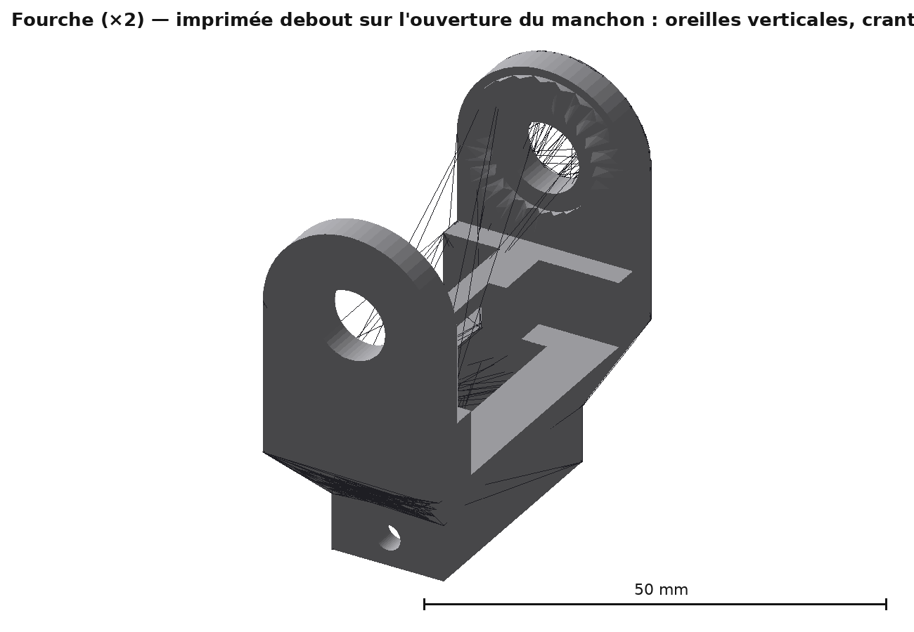

Oreilles 4 mm à |Y| = 19…23 (hors tout **46**), rayon 11, **toutes deux crantées** (24 dents sur la face intérieure) et alésées Ø8,6 : la fourche n'a plus de sens de montage. Bloc racine 46 × 22 (X = −19…−11) **encoché** au centre (seule la section du corps 24 × 8 subsiste pour |Y| < 16) : c'est ce qui dégage la face arrière de la tête jusqu'à 135°. Évasement loft 29,8 × 13,8 → 46 × 22 sur 8 mm, manchon 29,8 × 13,8 avec logement 24,2 × 8,2 profond 21 (fond en X = −13) : **ajustement serré 0,1** par côté, à coller (une goutte de cyanoacrylate sur deux faces), les goupilles Ø3,2 maintenant l'alignement pendant la prise. Canal 18 × 2,4 jusqu'à la fenêtre (X = −11) avec **bouche en entonnoir** côté fenêtre (18 × 2,4 → 20 × 5,4 sur 1,5 mm : la nappe qui arrive de biais est rabattue dans le canal) et chanfrein 0,5 côté fond de manchon (rattrape le décalage corps/fourche).
Impression **debout sur l'ouverture du manchon** : oreilles verticales, dents en nervures sur face verticale, alésages horizontaux — aucun surplomb. Hauteur 45 mm, bordure (brim) 5 mm conseillée.

### 6.3 Corps de bras

Barre 24 × 8 × 124 (= `bras_L` − 26), canal 18 × 2,4 débouchant à **bouches chanfreinées 0,6** (entonnoirs), 2 trous de goupille à 17,5 mm de chaque bout. Imprimé à plat (pont de 18 mm sur toute la longueur : sans souci). Pour un autre entraxe, ne réimprimer que cette pièce (paramètre `bras_L`, ou variable d'environnement `ARM_L`).

### 6.4 Pied, collier-tourelle (lacet) et goupille de retenue

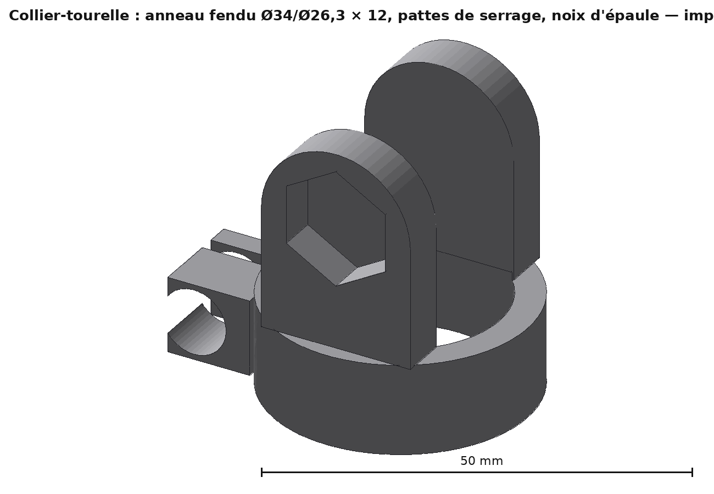

* **Pied couvercle** (`01_pied_couvercle`) : platine 50 × 46 × 4 dont le fût est décalé de 7 mm vers le bord −y (bord de platine à 16 mm de l'axe du fût : le fût garde 3 mm de platine devant lui, le trou Ø22 du gabarit 5 mm, et le trou du couvercle reste 2 mm à l'intérieur de la paroi) ; 4 fentes 3,4 × 8 en (±19, −8) et (±19, +22), à 4 mm des bords. *Correctif du 01/10 : la macro portait `pied_decal` = 10 (bord à 13 mm), d'où un fût tangent au bord, un trou de gabarit à 2 mm du bord et des fentes avant à 1 mm ; l'étude était déjà écrite pour 16 mm.* ; fût Ø26 **lisse** h 11,5 (il s'arrête 0,5 mm sous le haut du collier, sans congé à sa base pour que l'anneau du collier repose sur la platine), **rainure de retenue** 3,4 × 1,2 à mi-hauteur (Z = 6), alésage Ø20 dont les deux arêtes (haut du fût, dessous de la platine) sont **chanfreinées à 45° sur 1,2 mm** : la nappe de 16 mm y passe à plat, se tord au lacet et n'y frotte jamais sur une arête vive. Pose : bord −y de la platine affleurant la face extérieure de la paroi du boîtier côté connecteur CAM ; **trou Ø22 dans le couvercle** sous le fût, donc à 16 mm du bord extérieur du boîtier, et 4 trous Ø3,4 (ou 2 seulement) aux fentes. Le **gabarit** `01c_gabarit_percage_couvercle` (plaque 1,2 mm au contour de la platine, percée des 5 trous) se pose sur le couvercle pour pointer ; le même motif est fourni en `export/gabarit_couvercle.dxf` et `.svg` pour l'intégrer directement dans la CAO du couvercle.
* **Variante platine centrée** (`01a_pied_plat_centre`) : 46 × 46, fentes en (±17, ±17), pour une surface d'accueil large.
* **Goupille de retenue** : la goupille Ø3 imprimée (la même que celles du bras, 5ᵉ exemplaire) traverse un bossage du collier (côté opposé aux pattes, Z = 6) et court dans la rainure du fût, engagée de 0,8 mm avec 0,5 mm de jeu axial : le collier tourne librement sur 360° mais ne peut plus être soulevé. Elle se retire par sa tête pour démonter.
* **Collier-tourelle** : anneau Ø34 / Ø26,6 × 12, fente 2 mm, deux pattes 8 × 9 × 10 (poche hexagonale d'un côté, passage Ø8,6 de l'autre) serrées par la vis M8 × 20 + écrou hexagonal 13 × 5 ; la noix d'épaule symétrique (2 plaques R10 à poche hexagonale, gap 18, col 16) est posée sur le **mur de l'anneau** par deux **pieds chanfreinés à 45°** (face intérieure de Ø26,6 au niveau de l'anneau jusqu'aux faces de plaque écartées de 18, 4,3 mm plus haut) : rien ne surplombe l'alésage à l'impression, rien n'entre dans le volume du fût. Bossage Ø8 × 2 percé Ø3,2 pour la goupille de retenue. *Correctif du 01/10 soir : la version précédente faisait traverser aux plaques le tenon du fût (436 mm³) et la bague de retenue (431 mm³), la bague Ø32 ne pouvait pas passer entre les plaques (18), les plaques surplombaient l'alésage (175 mm³ sans rien dessous) et le congé du fût occupait le bas de l'anneau (318 mm³) ; tenon, bague et congé sont supprimés, et la macro contrôle désormais collier/pied, goupille/pied, goupille/collier et le surplomb.* Le serrage du collier fige le lacet par friction sur le fût (couple de tenue ≈ 0,4 N·m avec 100 N de serrage, très supérieur aux sollicitations d'une caméra fixe).
* **Adaptateur cavalier** (variante) : platine 46 × 46 × 4 à cheval sur une paroi de `mur_ep` = 3 (+0,4 de jeu) ; joue extérieure 25 mm, intérieure 14 mm (paramètres), 2 trous Ø3,4 pour pincer la paroi à travers les fentes d'aération, 2 trous Ø3,4 recevant le pied plat, passage Ø22 pour la nappe. Imprimé retourné.

### 6.5 Tête caméra

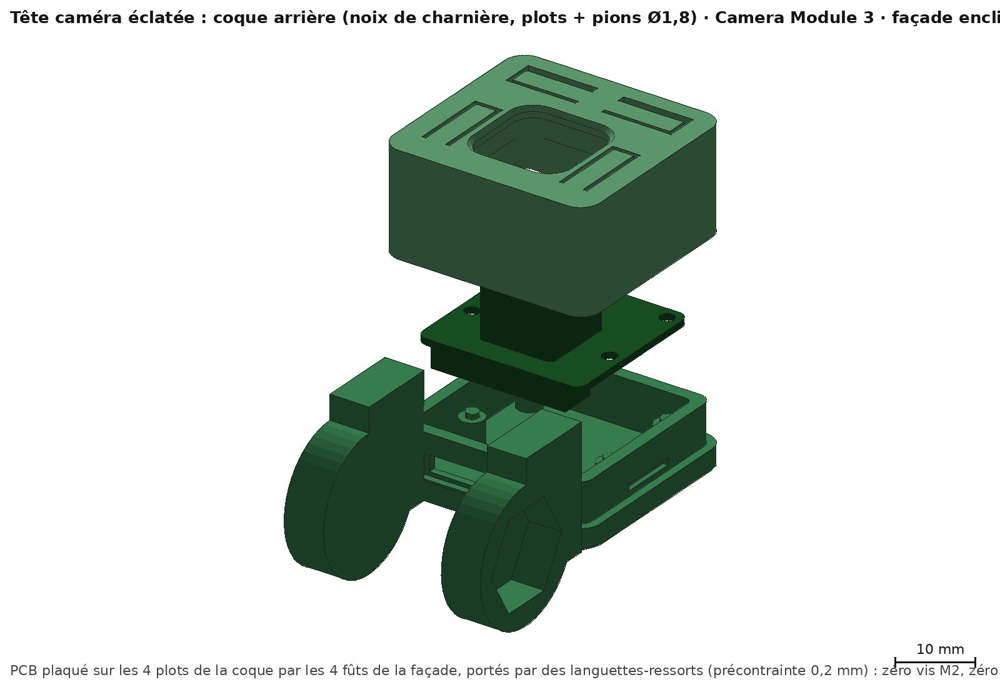
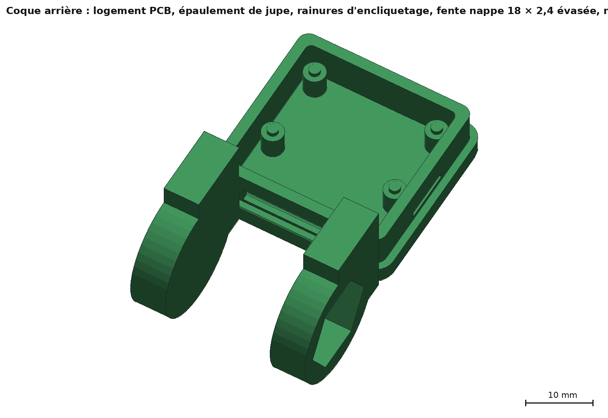
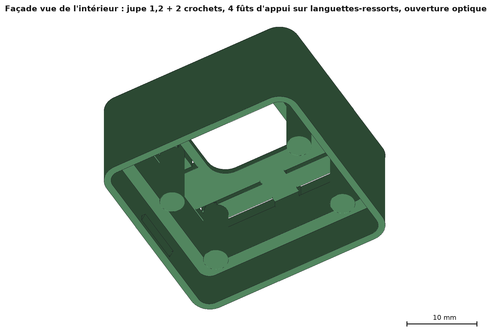

* **Coque** 31,6 × 30,4, fond 2, logement PCB 25,6 × 24,4 (jeu 0,3/0,27 par côté), 4 plots Ø3,6 h 4 + pions Ø1,8 **h 0,8** aux trous (**référence rigide** de la caméra, solidaire de la charnière ; les pions s'arrêtent 0,2 mm sous la face avant du PCB pour que les fûts de la façade portent toujours sur le PCB et jamais sur eux), fente nappe 18 × 2,4 centrée sur z = 4,8 dans la paroi basse avec **entonnoirs de 0,8** sur ses deux bouches (côté logement et côté fenêtre), épaulement de jupe 1,2 × 6 et 2 rainures d'encliquetage, noix de charnière symétrique (plaques 6 mm à |x| = 9…15, R10, col 12, dépassement arrière 5,2 mm du disque). Imprimée sur sa paroi haute (noix vers le haut) : c'est l'orientation sans surplomb, le dépassement arrière des disques interdisant l'impression sur le fond.
* **Façade** : jupe 1,2 mm (jeu 0,15) avec 2 crochets 0,6 × 8 (rampe d'entrée, face de retenue plate), plaque avant 1,5 mm, ouverture optique carrée **14** (r 3) centrée sur l'objectif et **chanfreinée à 45° sur 0,6** côté avant, 4 fûts Ø3,6 descendant **0,2 mm au-delà** de la face avant du PCB (`pcb_serrage`). Chaque fût est porté par une **languette-ressort** découpée dans la plaque par une fente en U de 0,6 (fûts hauts : languettes de 3 × 1,5 mm le long de x, encastrées vers le centre, 8,5 mm utiles ; fûts bas : le long de y, encastrées vers la paroi basse, 7,9 mm utiles). Les fentes sont verticales à l'impression (façade à plat) : elles s'impriment proprement, contrairement à des fentes dans le fond de la coque, qui seraient horizontales et se refermeraient. Le bloc objectif (8,5 mm, ≈ 11,5 de côté) reste **1,7 mm** sous la face intérieure et à 1,25 mm des bords de l'ouverture : aucun contact, aucun vignettage (demi-angle diagonal 37,5° pour le module standard, demi-angle libre 60° grâce au chanfrein ; le Module 3 Wide, à ≈ 60° de demi-diagonale, est à la limite : un léger vignettage dans les coins extrêmes n'est pas exclu, à vérifier sur image).
* **Tenue sans jeu (révision du 01/10)** : la version précédente avait des fûts affleurant exactement la face du PCB, donc un jeu axial de 0 ± 0,15 mm selon les cotes d'impression, et un PCB qui pouvait flotter de ±0,2 mm (pions dans des trous Ø2,2) : sous vibration, une rotation de ±0,5° de l'image était possible. Maintenant les 4 fûts plaquent le PCB sur les 4 plots rigides de la coque avec une précontrainte de 0,2 mm absorbée par les languettes : raideur 13,6 / 16,7 N/mm (PLA, hautes / basses), force totale ≈ **12,1 N** (3 à 21,2 N sur toute la plage de tolérance ±0,15 de l'empilage PCB + plots + fûts), déformation maximale des languettes 1,25 %. Le PCB (4 g) ne décolle des plots qu'au-delà de ≈ 77 g d'accélération ; le frottement sous 12,1 N bloque tout glissement latéral dans le jeu des pions. Les deux crochets de la façade reprennent ces 12,1 N sur 2 × 4,8 mm² de face de retenue (< 2 MPa).
* **Zones respectées** : flex autofocus (x ∈ ±6, y ∈ 3…10 à l'avant) — la façade ne touche le PCB qu'aux 4 trous ; connecteur dos 20,5 × 5,5 × 3 ; composants dos ≤ 1,5 mm.
* Thermique : IMX708 < 0,5 W ; la coque fermée suffit. Deux fentes latérales optionnelles si usage en plein soleil.

### 6.6 Visserie imprimée

| Pièce | Qté | Détail |
|---|---|---|
| Vis moletée M8 pas 2, L11 | **4** | articulations épaule et tête, une de chaque côté |
| Vis moletée M8 pas 2, L20 | 1 | collier de lacet |
| Écrou-rosette 24 dents | **4** | hexagone 13 × 3,5 (recul de 1,5 mm au montage), flasque conique, dents 1 mm |
| Écrou hexagonal 13 × 5 | 1 | collier |
| Goupille Ø3 × 7 à tête | 4 | emmanchement corps/fourches (facultatif si collage) |

Filet : profil 60° aplati (crête plate 0,35, fond plat 0,5), profondeur 0,9, noyau Ø6, **jeu radial écrou 0,3** (0,6 sur le diamètre ; valeur calée par l'essai d'impression du 01/10 : à 0,4 la vis flottait dans l'écrou). Le pas de 2 mm est délibérément « gros » : c'est ce qui rend un filet FDM fiable avec une buse 0,4.

**Construction et vérification du filetage** (correction du 30/09, à la suite de ta demande de vérifier la vis). La première version construisait le filet par balayage hélicoïdal du profil puis fusion avec le noyau : OCCT échouait silencieusement sur ce booléen et **les vis livrées étaient des cylindres lisses, les écrous des trous lisses**. La macro construit maintenant la tige filetée par **loft lisse de sections complètes** : chaque section transversale est un polygone de 48 points dont le rayon suit le profil de filet en fonction de l'angle, et la section tourne avec z (12 sections par pas). Noyau et filet forment un seul solide, sans aucun booléen fragile ; la tête est fusionnée avec 1 mm de pénétration, la pointe est conique (réduction des dernières sections). Les écrous sont obtenus par découpe d'une « vis virtuelle » majorée du jeu. Contrôles automatiques dans la macro :

* présence des gorges dans chaque écrou (alternance matière/vide au rayon moyen du filet : 6 transitions sur l'écrou-rosette, 5 sur l'écrou hexagonal) ;
* dans l'assemblage, chaque vis est tournée sur son axe à la phase qui centre ses crêtes dans les gorges de son écrou (épaule 180° / 180°, tête 180° / 180°, collier 315°) ; volume d'interpénétration vis/écrou à cette phase : **0 mm³** (pire des 4 vis d'articulation), distance mini 0,148 mm ;
* preuve d'existence du filet : la même vis tournée d'un demi-tour (décalage d'un demi-pas) pénètre l'écrou de **20,849 mm³**.

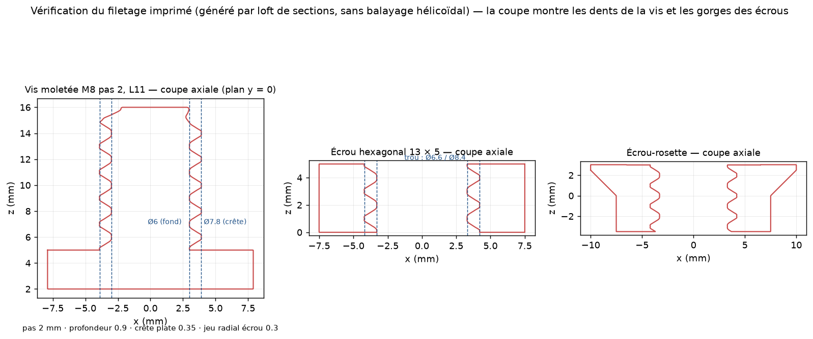

Le lissage B-spline arrondit légèrement les angles du profil et consomme une partie du jeu aux coins ; le jeu avait donc été porté de 0,3 à 0,4 par prudence. **Essai d'impression du 01/10 (PLA, CORE One HF0.4, couches 0,15)** : à 0,4 la vis flotte dans l'écrou (taraudage trop large). Le jeu nominal est **revenu à 0,3** (−0,2 sur le diamètre du taraudage) ; la vis ne dépend pas du jeu, celle déjà imprimée reste bonne. Si l'écrou à 0,3 tourne trop dur, 0,35 est l'étape suivante ; s'il flotte encore, 0,25.

---

## 7. La nappe : trajet, budget, consignes

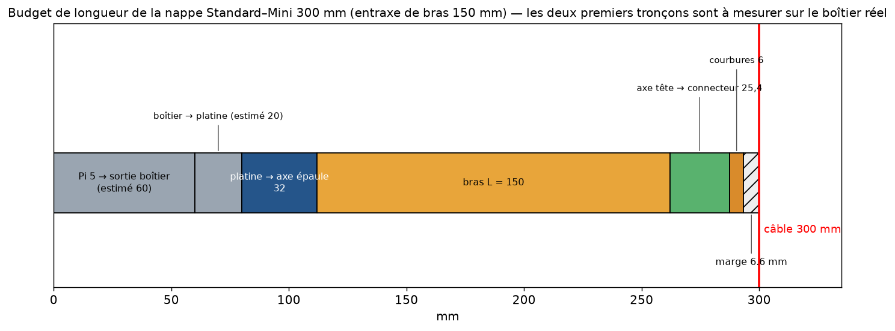

| Tronçon | mm | Statut |
|---|---|---|
| Connecteur CAM du Pi 5 → couvercle (≈ 35 mm mesurés + coude + insertion) | 45 | mesuré sur photo, à confirmer |
| Couvercle → dessous de la platine (platine posée sur le couvercle) | 0 | — |
| Platine → axe d'épaule (fût + collier + col) | 32 | calculé |
| Bras (entraxe) | 150 | paramètre |
| Axe de tête → connecteur CM3 (col + paroi + dos + insertion) | 25,4 | calculé |
| Réserve de courbure aux deux charnières | 6 | calculé |
| **Total** | **258,4** | **marge 41,6 mm** sur 300 (21,6 mm avec le corps de 170) |

Deux corps de bras sont fournis : **150** (marge ≈ 42 mm, recommandé pour la première impression) et **170** (`04a_bras_corps_L170_alt`, marge ≈ 22 mm). Au-delà, passer au câble officiel Standard–Mini **500 mm** (alors `bras_L` jusqu'à ≈ 330, ou deux segments + coude, § 13).

Consignes de montage de la nappe (séquence détaillée au § 10, vérification au § 16) :
1. **Le connecteur de la caméra se branche PCB hors de la coque.** Son verrou coulisse vers le bord bas du PCB ; une fois le PCB dans son logement il n'a que 0,25 mm devant lui : il est inopérable. On branche donc d'abord, puis on pose le PCB sur ses pions en laissant la nappe filer par la fente.
2. Ordre conseillé : brancher d'abord l'extrémité **Mini** sur le Pi 5 (couvercle déposé, accès total au verrou sous le HAT), puis enfiler l'extrémité **Standard** vers le haut : trou du couvercle → fût → fenêtre d'épaule → bras assemblé → fenêtre de tête → fente de la coque. Toutes les entrées sont évasées : la nappe (16 × 0,3, raidisseurs ≈ 0,6) se pousse à la main sur les 150 mm de canal. L'ordre inverse (caméra d'abord, Pi en dernier) fonctionne aussi mais oblige à brancher le Pi couvercle soulevé d'environ 40 mm.
3. Contacts orientés comme sur les photos (côté standard : contacts vers le PCB, verrou refermé après insertion complète ; côté Pi : contacts vers la carte).
4. Il n'y a **pas de mou possible dans la tête** (le connecteur débouche directement sur la fente) : la réserve (≈ 40 mm) se loge **dans le boîtier du Pi**, en S large (rayon ≥ 5 mm), jamais pincée sous le couvercle ni sous la platine. Ne jamais tendre la nappe sur un connecteur.
5. Marquer la position neutre du lacet (trait sur le collier et le fût) : rester dans ±90° (torsion répartie sur ≈ 50 mm libres, 1,4 mm de mou suffisent).
6. Ne pas plier au-delà de 120° à la tête ni descendre l'épaule sous 95°.

---

## 8. Vérifications effectuées (automatiques, dans la macro)

* **Validité géométrique** : 17 solides `isValid()` = vrai, 1 seul solide par pièce (la façade en produisait 5 avant correction des fûts d'appui ; les languettes-ressorts et les entonnoirs n'ont rien changé).
* **Filetage** (§ 6.6) : gorges présentes dans les deux écrous (6 et 5 transitions), interpénétration vis/écrou 0 mm³ à la phase alignée (pire des 4 vis d'articulation) contre 20,849 mm³ à un demi-pas de décalage, distance mini 0,148 mm (jeu 0,3). Ce contrôle a été ajouté après la découverte que la première construction produisait des vis lisses.
* **Concordance des axes** : axe local du bras sur l'axe d'épaule (0, 0, 28) ; écart axe de tête = 0,000 mm.
* **Interférences** (volumes communs, mm³) : 0 pour épaule 0/30/60/90/100°, tête 0/30/60/90/120/135° ; fourche/collier 0 ; fourche/coque 0 ; corps/fourches 0 ; vis/oreilles 0 ; filets vis/écrou 0 ; façade/coque 0. Valeurs non nulles **attendues** : oreilles/écrous-rosette 5,086, 5,064, 4,589, 4,589 mm³ (dents modélisées avec 3 % de recouvrement pour la robustesse booléenne), maquette CM3/coque 0,257 mm³ (recouvrement volontaire de 0,01 mm des plots), **maquette CM3/façade 5,145 mm³ = les 4 fûts qui dépassent de 0,2 mm** (précontrainte des languettes, § 6.5).
* **Collier / pied** (correctif du 01/10 soir) : collier ∩ pied 0 mm³, goupille de retenue ∩ pied 0 (elle court dans la rainure), goupille ∩ collier 0, matière du collier en surplomb de l'alésage 0 mm³.
* **Montage de la fourche sur la noix** (révision du 01/10) : fourche glissée suivant X de −30 à 0 mm par pas, écrous enfoncés de 1,5 mm : interférence maximale 0 mm³ sur tout le trajet, fourche/noix seule 0 mm³, jeu dents/dents au passage 0,5 mm ; écrous ramenés en position de travail : 9,558 mm³ (le recouvrement volontaire des dents).
* **Serrage du PCB** : raideur des languettes (poutre encastrée, E = 3,3 GPa PLA / 2,1 GPa PETG), force totale 12,1 N (PLA) / 7,7 N (PETG) à 0,2 mm, plage 3–21,2 N sur ±0,15 de tolérance, déformation max 1,25 %, décollement du PCB au-delà de 77 g.
* **Objectif** : dégagement axial 1,7 mm, latéral 1,25 mm par côté, demi-angle libre 60°.
* **Passages de la nappe** : sections et entonnoirs listés dans `rapport.json` (`passages_nappe`) ; connecteurs Standard (16 × ≈ 0,6) et Mini (≤ 16 × ≈ 0,6) inférieurs à toutes les sections (18 × 2,4 ; Ø20 ; Ø22).
* **Vibrations** : premier mode du bras (console 150 mm, 31,1 g en bout + 13,6 g de corps) ≈ 47 Hz dans le plan faible et 132 Hz dans le plan fort (PLA ; 37 Hz en PETG). Les sources domestiques (pas, ventilateur du Pi 5 à 30–130 Hz) ont des amplitudes micrométriques : sans jeu dans la chaîne (charnières serrées des deux côtés, corps collé, PCB précontraint), le déplacement angulaire de l'image reste très inférieur à un pixel.
* **Rayon de pliage de la nappe** (arc tangent dans la fenêtre de 22 mm) : 41 mm à 30°, 19 à 60°, 11 à 90°, 7,7 à 110°, 6,4 à 120°, 4,6 à 135°.
* **Budget câble** : § 7.
* **Orientation d'impression de la fourche** : vérifiée par assertion (le point le plus bas est l'ouverture du manchon).
* **Coupes axiales de la visserie** : `freecad/verif_filetage_freecad.py` (sous `freecadcmd`) exporte les coupes, `freecad/verif_filetage_figure.py` trace la figure `renders/43_verification_filetage.png`.

Non vérifié (à faire sur pièces réelles) : couple de serrage réel des vis imprimées, tenue au fluage à long terme, cotes FDM de ta machine (§ 9.3).

---

## 9. Impression sur la Prusa

### 9.1 Nomenclature des pièces à imprimer

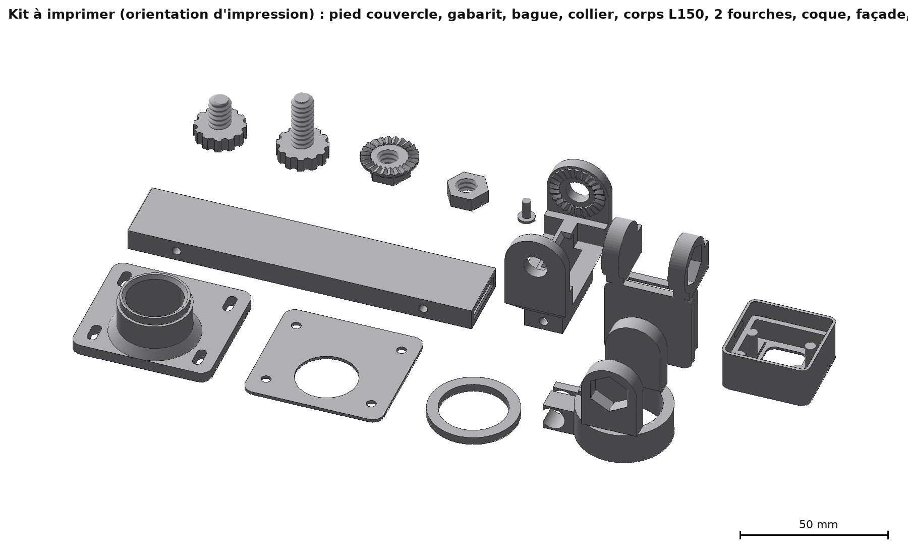

| Fichier STL (`export/stl/`) | Qté | Orientation (déjà appliquée dans le STL) | Volume plein | Remarques |
|---|---|---|---|---|
| `01_pied_couvercle` | 1 | platine sur le plateau | 9,6 cm³ | fixation sur couvercle |
| `01c_gabarit_percage_couvercle` | 1 | à plat | ≈ 2 cm³ | gabarit de pointage des 5 trous du couvercle |
| `01a_pied_plat_centre` | 0/1 | platine sur le plateau | 8,8 cm³ | variante |
| `01b_cavalier_adaptateur` | 0/1 | retourné (joues en haut) | 13,9 cm³ | variante paroi |
| `03_collier_tourelle` | 1 | debout (anneau sur le plateau) | 8,7 cm³ | brim 5 mm ; pieds à 45° sans support |
| `04a_bras_corps_L150` | 1 | à plat | 18,4 cm³ | pont 18 mm |
| `04a_bras_corps_L170_alt` | 0/1 | à plat | ≈ 21 cm³ | alternative entraxe 170 |
| `04b_fourche_x2` | **2** | debout sur le manchon | 11,5 cm³ | brim 5 mm ; crantées des deux côtés |
| `04c_goupille_x5` | 5 | tête sur le plateau | 0,1 cm³ | 4 pour les fourches (facultatives si colle), 1 de retenue du collier |
| `05_tete_coque` | 1 | paroi haute sur le plateau, noix en haut | 6,8 cm³ | pont de 18 mm sur la fente nappe |
| `06_tete_facade` | 1 | face avant sur le plateau | 4,8 cm³ | fentes de ressort 0,6 verticales ; 100 % de remplissage |
| `07_vis_M8_L11_x4` | **4** | tête sur le plateau | 1,5 cm³ | couches 0,15 |
| `08_vis_M8_L20` | 1 | tête sur le plateau | 1,8 cm³ | couches 0,15 |
| `09_ecrou_rosette_x4` | **4** | hexagone sur le plateau, dents en haut | 1,1 cm³ | couches 0,15 |
| `10_ecrou_hex` | 1 | à plat | 0,5 cm³ | couches 0,15 |

Total ≈ 87 cm³ « pleins », soit ≈ 75 à 85 g une fois remplis à 25 % ; durée totale ≈ 9 à 11 h en 0,2 mm (estimation grossière, à confirmer dans PrusaSlicer). **Aucun support** sur aucune pièce.

### 9.2 Réglages conseillés

* PETG, buse 0,4, couches 0,2 (0,15 pour la visserie et les écrous) ; 3 périmètres (4 pour les fourches et le collier) ; remplissage gyroïde 25 % (100 % pour vis, écrous, goupilles, bague).
* Pas de supports ; brim 5 mm pour les fourches et le collier ; ventilation PETG normale ; température de lit propre à ton filament.
* **Tout en PLA** (ton choix pour l'impression définitive) : couches 0,15 partout, 4 périmètres, 100 % de remplissage pour la visserie, les écrous, la façade (languettes) et les fourches, 25–40 % gyroïde ailleurs, 215 °C / lit 60 °C, ventilation 100 % dès la 3ᵉ couche, aucun support. Le PLA flue sous précontrainte : resserrer les 5 vis après 24 h puis après la première semaine ; il ramollit vers 55–60 °C : pas de pose derrière une vitre en plein soleil ni dans un boîtier qui chauffe. Les languettes de façade travaillent à ≤ 1,3 % de déformation (relaxation possible de la force, jamais perte de contact) ; la rosette crantée tient l'angle sans dépendre du serrage résiduel.
* Ordre conseillé : **d'abord le kit de calibration du filetage** `export/stl/20_kit_calibration_plateau.stl` (≈ 25 min) : une vis L11 et un écrou-rosette au jeu nominal. L'écrou doit s'engager sans forcer et tourner avec deux doigts sans jeu perceptible ; trop dur → augmenter `vis_jeu` de 0,05 à 0,1, trop libre → le diminuer d'autant, puis régénérer. Seuls les écrous dépendent du jeu : les vis définitives peuvent être imprimées dès ce premier essai. **Résultat du 01/10** : le premier kit (0,4) flottait ; le kit livré est maintenant à **0,3**, seul l'écrou `20_kit_calibration_ecrou_rosette_jeu03.stl` serait à réimprimer pour confirmer avant le kit complet (étape facultative). Le kit est produit par `freecad/kit_calibration.py` ; avec `JEUX="0.3,0.4,0.5"` il sort un kit comparatif de trois écrous marqués 1, 2 et 3 points.

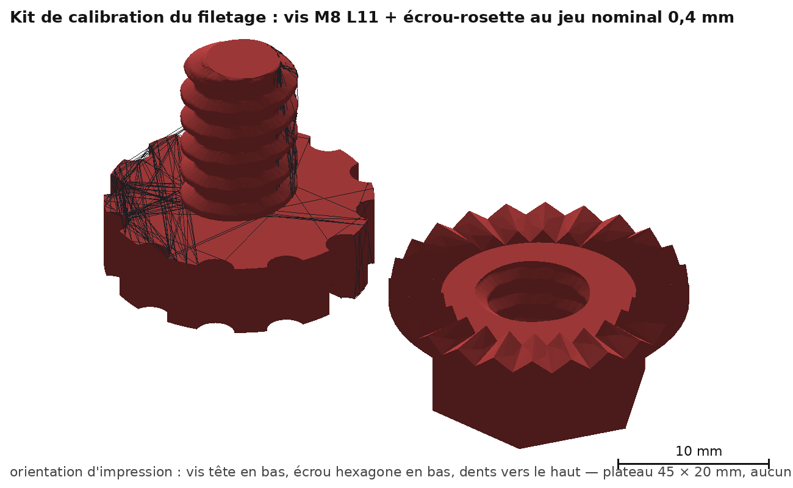

### 9.3 Tolérances et jeux prévus (paramètres)

| Ajustement | Jeu prévu | Paramètre |
|---|---|---|
| Corps de bras dans le manchon de fourche | **0,1 par côté** (serré : poncer légèrement le bout du corps si besoin, puis coller) | `manchon_jeu` |
| Collier sur fût | 0,3 par côté (Ø26,6 / Ø26) | `collier_jeu` |
| Goupille de retenue dans la rainure du fût | 0,8 mm d'engagement, 0,5 de jeu axial | `rainure_*`, `boss_goupille_L` |
| PCB dans la coque | 0,3 / 0,27 par côté | `pcb_jeu_l`, `pcb_jeu_h` |
| Jupe de façade sur épaulement | 0,15 par côté | `jupe_jeu` |
| Hexagone dans les poches | 0,3 | `ecrou_jeu` |
| Filet vis / écrou | **0,3 radial** (calé par l'essai du 01/10 ; 0,4 flottait) | `vis_jeu` |
| Alésage d'oreille / filet de vis Ø7,8 | 0,4 radial (la position est donnée par les dents, pas par l'alésage) | `oreille_trou` |
| Fûts de façade / face avant du PCB | **−0,2 (précontrainte)**, absorbée par les languettes | `pcb_serrage` |
| Bloc objectif / face intérieure de la façade | 1,5 (+0,2 de serrage) | `jeu_objectif` |
| Bloc objectif / ouverture 14 | 1,25 par côté | `ouverture` |

Si ta Prusa imprime « gras » (trous étroits), augmente `vis_jeu` et `collier_jeu` de 0,1, puis régénère (§ 14) ; l'essai du 01/10 montre au contraire qu'elle imprime plutôt « maigre » sur les taraudages. Si le collier ne serre pas assez : réduire `collier_jeu` ou élargir `fente_collier`.

---

## 10. Montage pas à pas (aucun outil)

Séquence révisée le 01/10 (vérifiée sur le modèle, § 16). Principe : on assemble d'abord toute la mécanique **sans la nappe**, on branche le Pi couvercle déposé, puis on enfile la nappe du Pi vers la tête et on branche la caméra en dernier, PCB hors de la coque.

1. **Bras** : emmancher les deux fourches sur le corps (21 mm, ajustement serré 0,1 : poncer légèrement le bout du corps s'il force), goupilles Ø3 pour l'alignement, une goutte de cyanoacrylate sur deux faces de chaque emmanchement. Les fourches sont symétriques : aucun sens à respecter.
2. **Base** : pied vissé ou goupillé sur le couvercle (gabarit § 6.4, couvercle déposé), collier enfilé sur le fût jusqu'à la platine (pattes à l'opposé du sens de basculement du bras, bossage de goupille vers le bras), **goupille de retenue** enfoncée dans le bossage jusqu'à sa tête (sa pointe court dans la rainure du fût : le collier est captif et tourne librement) ; vis L20 + écrou hexagonal dans les pattes, serrage léger.
3. **Charnières** (épaule puis tête) : pousser un écrou-rosette **au fond** de chaque poche hexagonale de la noix (il recule de 1,5 mm, dents vers l'extérieur), présenter la fourche dans l'axe du bras et la **glisser** sur la noix (oreilles de part et d'autre, rien à écarter), visser une vis L11 de chaque côté : chaque vis ramène son écrou contre l'oreille et les dents s'emboîtent. Serrer modérément pour l'instant.
4. **Pi 5** : couvercle encore déposé, brancher l'extrémité **Mini** sur CAM/DISP 0 (verrou relevé, contacts vers la carte, verrou rabattu).
5. **Enfilage** : passer l'extrémité **Standard** de bas en haut à travers le trou Ø22 du couvercle, l'alésage du fût, entre les plaques de noix du collier, dans la bouche évasée de la fourche d'épaule, le canal du corps, la fourche de tête, puis entre les plaques de noix de la coque et dans la fente de la paroi basse, jusqu'à ce qu'elle ressorte dans le logement du PCB. Pousser à la main, nappe à plat ; si elle bute, reculer de 5 mm et re-pousser (les entonnoirs la recentrent).
6. **Caméra** : tirer ≈ 20 mm de nappe dans la coque, brancher le connecteur du PCB (verrou tiré, contacts vers le PCB, verrou repoussé) **avec le PCB en main, hors de la coque**. Reprendre le mou par le bas (côté Pi) tout en descendant le PCB sur ses 4 pions ; la nappe plonge directement dans la fente. Emboîter la façade : clic des 2 crochets, les 4 fûts plaquent le PCB.
7. **Couvercle** : loger la réserve de nappe (≈ 40 mm) en S large dans le boîtier, sans la coincer sous le bord, et poser le couvercle.
8. **Réglage** : lacet → épaule → tête ; serrer les 5 vis à la main ; **resserrer après 24 h** (relaxation du PLA/PETG).

Réglage courant : desserrer ½ tour **les deux** vis de l'axe concerné, tourner par crans de 15°, resserrer les deux.

---

## 11. Quincaillerie

| Métal | Par défaut | Option |
|---|---|---|
| Vis M3 pour la platine | **0** (goupilles imprimées collées ou colle) | 2 à 4 × M3 × 8–12 + écrous ou inserts si tu préfères du démontable |
| Autres | **0** | — |

Tout le reste (5 vis, 5 écrous, 5 goupilles) est imprimé.

---

## 12. Points à mesurer / valider avant d'imprimer le tout

1. **Longueur de nappe consommée dans le boîtier Pi** : ≈ 35 mm entre le connecteur CAM et le bord du boîtier d'après la photo au mètre ; à confirmer une fois le couvercle en place. Si > 85 mm : garder le corps de 150, sinon le corps de 170 est possible.
2. **Couvercle** (décision prise) : percer le trou nappe Ø22 à 16 mm du bord extérieur, au-dessus du connecteur CAM, et les 4 trous Ø3,4 avec le gabarit ; vérifier que le couvercle est assez rigide sous la platine (renfort local 2 mm si le couvercle est ajouré).
3. **Sens de basculement souhaité** du bras (le collier se monte pattes à l'opposé) et position neutre du lacet.
4. **Hauteur du bloc objectif** : mesurer au pied à coulisse la distance face avant du PCB → sommet du bloc (métal ou lentille, le plus haut des deux). Le modèle prévoit 8,5 mm + 1,7 mm de dégagement : tant que la mesure est ≤ 10 mm (Wide compris), rien à changer ; sinon augmenter `objectif_h`. Mesurer aussi le côté du bloc (prévu 11,5, ouverture 14).
5. Impression de calibration : 1 vis L11 + 1 écrou-rosette (en cours) ; les fourches, le corps et la façade peuvent suivre dès que le jeu de filet est validé.

---

## 13. Évolutions possibles (sans refonte)

* **4ᵉ axe (coude)** : une pièce « noix–noix » (deux noix dos à dos avec un canal de 30 mm) entre deux corps de bras ; les fourches et la visserie existantes conviennent. Nécessite le câble 500 mm.
* **Câble 500 mm** : `bras_L` jusqu'à ≈ 330 mm en un seul segment (vérifier la flèche du corps 24 × 8 : à 330 mm et 20 g en bout, flèche < 1 mm).
* **Rotation de la tête sur elle-même (portrait/paysage)** : coque avec noix tournée de 90° (paramètre à ajouter) ; la fente de nappe devient latérale.
* **Fixation par écrou-tenon dans les fentes d'aération** : boulon plat imprimé glissé dans une fente + écrou à oreilles imprimé : zéro perçage du boîtier.
* **Adaptateur GoPro** : remplacer la noix de la coque par deux « doigts » GoPro pour utiliser des supports du commerce (mais vis M5 métal).
* **Ventilation de la tête** : 2 fentes latérales 1 × 8 si usage derrière une vitre au soleil.

---

## 14. Fichiers livrés et régénération

```
hardware/camera-arm/
├── ETUDE.md                          ← ce document
├── freecad/
│   ├── bras_camera_cm3.py            ← macro FreeCAD paramétrique (dictionnaire P en tête de fichier)
│   ├── render_stl.py                 ← rendus PNG sans OpenGL (rastériseur numpy)
│   ├── make_renders.py               ← série de rendus de l'étude
│   ├── schemas_2d.py                 ← schémas cotés (matplotlib)
│   ├── verif_filetage_freecad.py     ← contrôle de la visserie imprimée (coupes axiales, volumes) sous freecadcmd
│   ├── verif_filetage_figure.py      ← figure 43 à partir des coupes
│   └── kit_calibration.py            ← kit d'essai du jeu de filetage (vis + écrou nominal ; JEUX=... pour un kit comparatif)
│       (l'écrou du kit livré le 01/10 a un hexagone de 3,5 au lieu de 4,5 : le filet testé est identique)
├── export/
│   ├── fcstd/00_assemblage.FCStd     ← toutes les pièces placées (pose par défaut) + feuille « Pose »
│   ├── fcstd/NN_*.FCStd              ← une pièce par document + feuille « Parametres »
│   ├── step/NN_*.step                ← STEP (repère de conception)
│   ├── stl/NN_*.stl                  ← STL orientés pour l'impression, posés en Z = 0
│   ├── gabarit_couvercle.dxf / .svg  ← motif de perçage du couvercle (repère : centre du fût)
│   ├── coupes_filet.json             ← coupes axiales vis / écrous (contrôle du filetage)
│   └── rapport.json                  ← paramètres, volumes, vérifications, budget nappe
└── renders/*.png
```

Régénérer avec d'autres paramètres :

* **Dans FreeCAD (Windows)** : Macro → Macros… → sélectionner `bras_camera_cm3.py` → Exécuter. Éditer d'abord `P = dict(...)` en tête de fichier (ex. `bras_L=130`). Les exports partent dans `%USERPROFILE%\bras_camera_out` (ou le dossier `OUT_DIR`).
* **En ligne de commande** : `OUT_DIR=./export ARM_L=130 freecadcmd -c "exec(open('bras_camera_cm3.py', encoding='utf-8').read())"` (≈ 75 s).
* Rendus : `python3 make_renders.py ./export ./renders` puis `python3 schemas_2d.py ./renders` (dépendances : numpy, pillow, matplotlib).

Le modèle est paramétrique **par le script** (relancer = tout régénérer, y compris les contrôles) ; les `.FCStd` contiennent les solides résultants (`Part::Feature`) et la feuille de paramètres à titre documentaire, pas un arbre PartDesign pilotable à la souris.

**Compatibilité de version** : les `.FCStd` ont été écrits par FreeCAD 26.3 (build conda-forge du 16/09/2026). Un FreeCAD 1.0 ou 1.1 les ouvre normalement (contenu `Part::Feature` + feuille de calcul), au pire avec un avertissement de version ; en cas de refus, importer les `.step` ou rejouer la macro dans ta version, ce qui régénère des fichiers natifs.

---

## 15. Risques et points d'attention

| Risque | Effet | Parade |
|---|---|---|
| Nappe trop courte (tronçons estimés) | impossible de brancher | mesurer (§ 12), `bras_L` ou câble 500 |
| Filet imprimé trop serré / trop lâche | vis bloquée ou écrou qui tourne | impression de calibration ; `vis_jeu` (0,3 calé sur ta machine le 01/10 ; 0,25 à 0,5 selon la machine) |
| Fluage PLA/PETG sous précontrainte | perte de serrage | rosette crantée (tenue positive, des deux côtés) ; resserrer à 24 h et après une semaine |
| PLA au-delà de 55 °C | ramollissement, perte des précontraintes | pas de soleil direct derrière une vitre ; PETG pour la visserie et la façade si doute |
| Languette de façade cassée au montage | fût libre, PCB mal plaqué | fentes 0,6 : ne pas forcer la façade de travers ; 100 % de remplissage pour la façade ; réimprimer (4,8 cm³) |
| Pliage de tête > 120° | rayon nappe < 6 mm | butée visuelle : ne pas dépasser le cran 8 (120°) |
| Torsion de nappe au lacet | fatigue du polyimide | ±90°, repère sur le collier |
| Pions Ø1,8 fragiles à l'impression | casse au montage | ils ne servent qu'au centrage ; le logement 25,6 × 24,4 positionne déjà le PCB, le serrage des fûts le fige |
| Nappe qui bute à l'enfilage | pliure | entonnoirs à toutes les bouches ; reculer et re-pousser, jamais forcer |
| Écrou-rosette qui tombe de la poche au montage | agaçant | léger serrage de l'hexagone (jeu 0,3) ; monter la vis aussitôt |
| Position réelle des connecteurs CAM du Pi 5 | choix du côté de fixation | à relever sur ton boîtier (les deux CAM/DISP sont sur le bord des micro-HDMI) |

---

## 16. Vérification du 01/10 : passage de la nappe et tenue de la caméra

Demande : s'assurer que la nappe et ses connecteurs s'enfilent facilement dans le bras, que la pose finale sur le couvercle ne l'abîme pas, et que l'objectif est positionné sans jeu dans sa pièce (image insensible aux vibrations). Résultat : **deux défauts réels trouvés et corrigés** (verrou du connecteur caméra inaccessible PCB en place ; PCB sans précontrainte) et **un défaut de montage de la charnière** (tourillon fixe) corrigé par la même occasion.

### 16.1 Nappe et connecteurs

| Point vérifié | Constat sur le modèle | Décision |
|---|---|---|
| Sections de passage | fente de tête 18 × 2,4 ; canal des fourches et du corps 18 × 2,4 ; fenêtres 18 ; fût Ø20 ; couvercle Ø22. Connecteurs : Standard 16 × ≈ 0,6, Mini ≤ 16 × ≈ 0,6 | passent partout, dans les deux sens |
| Accrochage aux bouches | bouches à angle vif : une nappe poussée de biais bute sur la paroi | **entonnoirs** : corps 0,6, fourche 1,5 (côté fenêtre) + 0,5 (côté manchon), fente de tête 0,8 des deux côtés, fût chanfreiné 1,2 haut et bas |
| Marche corps/fourche | jeu de 0,2 par côté → marche possible de 0,2 dans le canal | manchon serré à 0,1 + collage ; chanfreins qui se font face |
| Verrou du connecteur CM3 | coulisse vers le bord bas ; 0,25 mm de jeu entre PCB et paroi basse : **inopérable PCB en place** | brancher PCB en main, hors de la coque (séquence § 10) ; pas de dégagement ajouté dans le logement, qui garderait un verrou inaccessible aux doigts |
| Mou dans la tête | impossible (le connecteur débouche sur la fente) | la réserve est dans le boîtier du Pi, en S large |
| Pose du couvercle | nappe traversant le trou Ø22 du couvercle, jamais sous le bord | brancher le Pi **avant** le couvercle (étape 4) ; si l'on branche la caméra d'abord, il reste ≈ 40 mm pour soulever le couvercle (faisable mais moins confortable sous le HAT) |
| Torsion de lacet | ±90° sur ≈ 50 mm libres : il suffit de 1,4 mm de mou pour que les bords de la nappe ne s'allongent pas | repère de position neutre, rester dans ±90° |
| Pliage aux charnières | arc tangent, rayon 11 à 90°, 6,4 à 120° (≥ 20 × l'épaisseur) ; axe dans le plan de nappe → longueur constante | inchangé ; ne pas dépasser 120° |

### 16.2 Objectif et PCB : zéro jeu

* **Ce qui référence la caméra** : ses 4 trous (pions Ø1,8) et sa face arrière sur les 4 plots de la coque, pièce qui porte la charnière. Le bloc objectif (≈ 11,5 de côté, 8,5 de haut, mesuré/estimé sur ta photo) **ne touche rien** : ouverture 14 (1,25 mm par côté) et 1,7 mm sous la façade. C'est volontaire : un bloc autofocus plaqué par la façade serait contraint, et l'image dépendrait de la façade et non de la charnière.
* **Défaut corrigé** : les fûts affleuraient le PCB (jeu 0 ± 0,15 selon l'impression). Désormais ils dépassent de 0,2 mm et sont portés par des languettes-ressorts découpées dans la plaque avant : force de plaquage ≈ 12,1 N en PLA (3 à 21,2 N sur toute la tolérance de l'empilage), soit un décollement au-delà de 77 g : le PCB ne peut ni vibrer axialement ni glisser dans le jeu de ses pions.
* **Pourquoi des languettes dans la façade et non dans le fond de la coque** : la coque s'imprime sur sa paroi haute (ses disques de noix dépassent de 5,2 mm derrière le fond) ; des fentes de ressort dans le fond seraient horizontales et se refermeraient à l'impression. La façade s'imprime à plat : ses fentes sont verticales, nettes, et les fûts sont d'aplomb.
* **Le reste de la chaîne** : charnières serrées des deux côtés (dents + précontrainte, plus de tourillon flottant), corps collé dans les fourches (0,1), collier serré sur le fût. Premier mode du bras ≈ 47 Hz (PLA) : les vibrations domestiques, d'amplitude micrométrique, ne produisent aucun déplacement visible de l'image dès lors qu'aucun jeu ne peut s'ouvrir.

### 16.3 Ce qui change dans les fichiers

`07_vis_M8_L11_x4` et `09_ecrou_rosette_x4` (quantités 4), `04b_fourche_x2` (crantée des deux côtés, entonnoir), `04a_bras_corps_*` (bouches chanfreinées), `05_tete_coque` (noix symétrique, fente évasée), `06_tete_facade` (languettes, ouverture 14 chanfreinée, fûts +0,2, profondeur de tête 18,5 au lieu de 17), `01_pied_couvercle` et `01a` (alésage chanfreiné). Paramètres nouveaux : `chanf_canal`, `chanf_fenetre`, `chanf_fente`, `chanf_fut`, `pcb_serrage`, `ressort_*`, `ouverture_chanfrein` ; modifiés : `ecrou_corps` 3,5, `manchon_jeu` 0,1, `ouverture` 14, `objectif_h` 8,5, `jeu_objectif` 1,5, `pion_h` 0,8 ; supprimés : `axe_d`, `boss_B_*`, `axe_long`. Le kit de calibration imprimé le 01/10 (jeu 0,4) a montré une vis flottante : le jeu est passé à 0,3 (écrou à réimprimer, vis conservée).

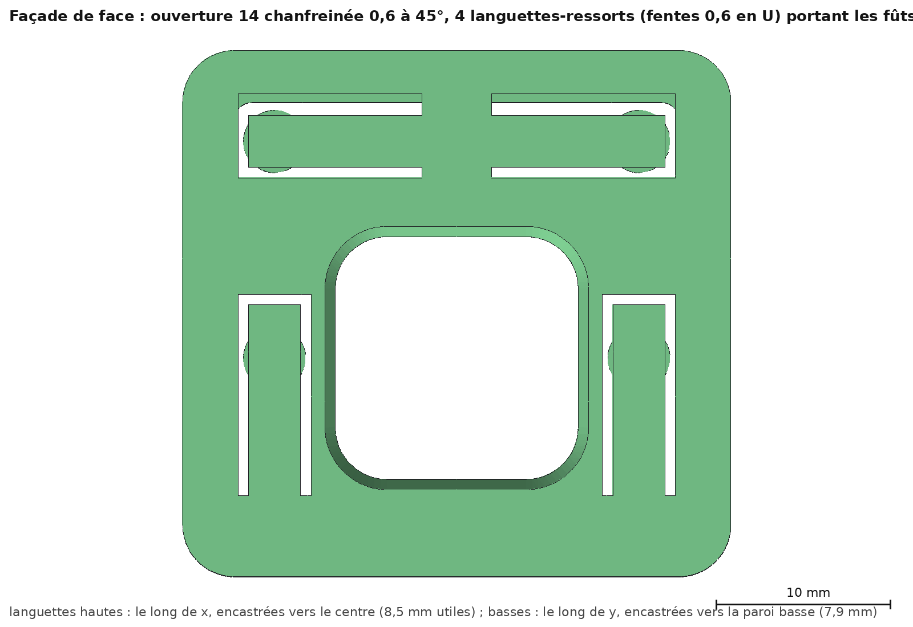

### 16.4 Correctifs après mise sur plateau (01/10 soir)

Deux défauts repérés en chargeant les STL dans PrusaSlicer, tous deux invisibles aux contrôles automatiques de l'époque :

1. **Pied couvercle et gabarit** : fût tangent au bord de la platine, trou Ø22 du gabarit à 2 mm du bord, fentes avant à 1 mm. La macro décalait le fût de 10 mm (bord à 13 mm de l'axe) alors que l'étude est écrite pour 16 mm. Corrigé (`pied_decal` 7, fentes arrière à +22) : marges 5 / 3 / 4 mm.
2. **Collier-tourelle** : les plaques de noix traversaient le tenon (436 mm³) et la bague de retenue (431 mm³), la bague Ø32 ne pouvait pas passer entre les plaques écartées de 18, les plaques surplombaient l'alésage (175 mm³ sans matière dessous, inimprimable) et le congé du fût occupait le bas de l'anneau (318 mm³ : le collier ne descendait pas sur la platine). Le contrôle « bras / base » fusionnait pied, bague et collier en un seul bloc et ne pouvait pas voir ces chevauchements. Refonte : fût lisse arrêté sous le collier, sans congé ; plaques posées sur le mur de l'anneau par des pieds chanfreinés à 45° ; retenue par une goupille Ø3 dans une rainure du fût ; quatre contrôles ajoutés (§ 8). Plage d'épaule recalculée : 0 → 100° sans contact.

Pièces supprimées : `02_bague_retenue`. Pièces modifiées : `01_pied_couvercle`, `01a_pied_plat_centre`, `01c_gabarit_percage_couvercle`, `03_collier_tourelle` ; `04c_goupille` passe à 5 exemplaires.
